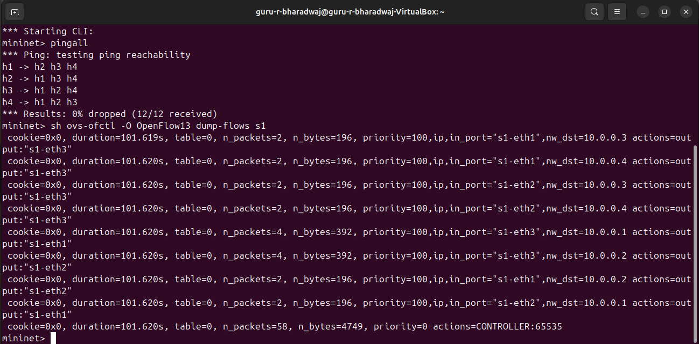
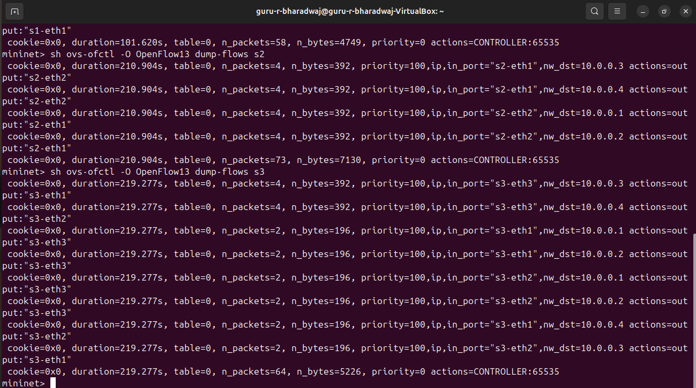
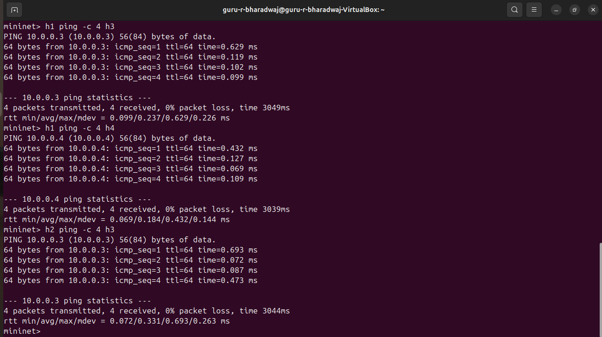
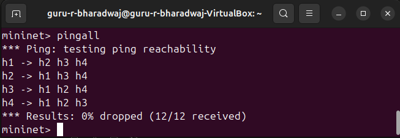
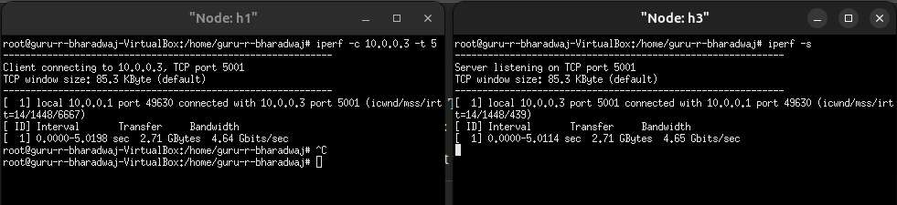
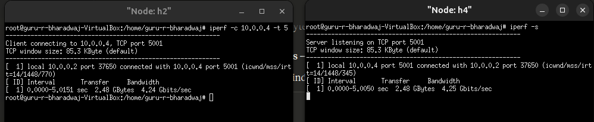
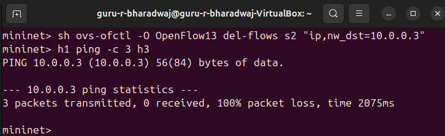
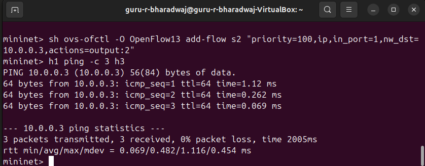
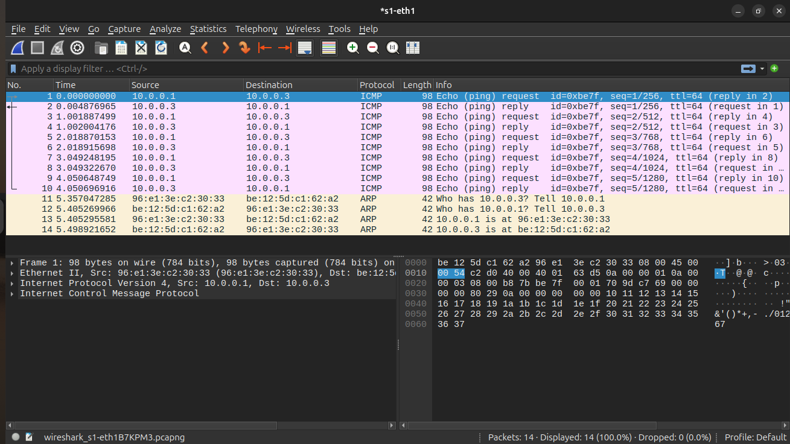

# Static Routing using SDN Controller

## Problem Statement
Implement static routing paths using controller-installed flow rules in an SDN environment using Mininet and Ryu controller. The controller manually installs OpenFlow flow rules on each switch to define fixed routing paths between hosts, demonstrating controller-switch interaction and network behavior observation.

## Objectives
- Define static routing paths across a 3-switch topology
- Install flow rules manually via SDN controller (Ryu)
- Validate packet delivery using ping and iperf
- Document routing behavior using flow tables and Wireshark
- Regression test: Ensure paths remain unchanged after rule reinstall

## Topology
```
H1 (10.0.0.1) --|         |-- H3 (10.0.0.3)
				S1 -- S2 -- S3
H2 (10.0.0.2) --|         |-- H4 (10.0.0.4)
```

- 3 OpenFlow switches (S1, S2, S3) connected in a line
- 4 hosts: H1, H2 connected to S1; H3, H4 connected to S3
- S2 acts as the core/transit switch
- All routing paths are statically defined via controller

## Routing Table

| Source | Destination | Path |
|--------|-------------|------|
| H1 | H2 | H1 -> S1 -> H2 |
| H1 | H3 | H1 -> S1 -> S2 -> S3 -> H3 |
| H1 | H4 | H1 -> S1 -> S2 -> S3 -> H4 |
| H2 | H3 | H2 -> S1 -> S2 -> S3 -> H3 |
| H2 | H4 | H2 -> S1 -> S2 -> S3 -> H4 |
| H3 | H4 | H3 -> S3 -> H4 |

## Project Structure
```
SDN-Static-Routing-Mininet/
|-- static_topo.py          # Mininet topology definition
|-- static_controller.py    # Ryu controller with static flow rules
|-- regression_test.py      # Regression test script
|-- README.md               # Project documentation
`-- Screenshots/            # Proof of execution
	|-- 01_pingall_and_flowtable_s1.png
	|-- 02_flowtable_s2_and_s3.png
	|-- 03_ping_results_scenario1_normal_routing.png
	|-- 04_pingall_0percent_loss_functional_correctness.png
	|-- 05_iperf_throughput_h1_to_h3.png
	|-- 06_iperf_throughput_h2_to_h4.png
	|-- 07_scenario2_failure_flow_deletion_100percent_loss.png
	|-- 08_scenario2_recovery_flow_reinstall_0percent_loss.png
	`-- 09_wireshark_icmp_arp_packet_capture_s1eth1.png
```

## Setup and Execution

### Requirements
- Ubuntu 24.04 LTS
- Mininet (`sudo apt install mininet -y`)
- Python 3.11
- Ryu Controller (installed in Python 3.11 virtual environment)
- Open vSwitch

### Step 1: Activate Ryu environment
```bash
source ~/ryu-env/bin/activate
cd ~/Desktop/SDN-Static-Routing-Mininet
```

### Step 2: Start Ryu controller (Terminal 1)
```bash
ryu-manager static_controller.py
```

### Step 3: Start Mininet topology (Terminal 2)
```bash
sudo mn --custom static_topo.py --topo statictopo --controller remote,port=6633 --switch ovsk,protocols=OpenFlow13
```

### Step 4: Test connectivity
```text
mininet> pingall
mininet> h1 ping -c 4 h3
mininet> h1 ping -c 4 h4
mininet> h2 ping -c 4 h3
```

### Step 5: Verify flow tables
```text
mininet> sh ovs-ofctl -O OpenFlow13 dump-flows s1
mininet> sh ovs-ofctl -O OpenFlow13 dump-flows s2
mininet> sh ovs-ofctl -O OpenFlow13 dump-flows s3
```

### Step 6: Run iperf throughput test
```text
mininet> xterm h1 h3
```
In h3 window: `iperf -s`  
In h1 window: `iperf -c 10.0.0.3 -t 5`

### Step 7: Run regression test
```text
mininet> sh python3 regression_test.py
```

## Expected Output

### pingall
```text
h1 -> h2 h3 h4
h2 -> h1 h3 h4
h3 -> h1 h2 h4
h4 -> h1 h2 h3
*** Results: 0% dropped (12/12 received)
```

### iperf (H1 to H3)
```text
[ 1] 0.0000-5.0198 sec  2.71 GBytes  4.64 Gbits/sec
```

### Regression Test
```text
RESULT: ALL TESTS PASSED
```

## Test Scenarios

### Scenario 1: Normal Routing
All hosts can reach each other with 0% packet loss via statically defined paths.

### Scenario 2: Failure and Recovery
- Flow rule deleted on S2 -> H1 cannot reach H3 (100% packet loss)
- Flow rule manually reinstalled -> H1 reaches H3 again (0% packet loss)

## Proof of Execution

### Flow Tables



### Ping Results



### iperf Throughput



### Failure and Recovery Scenarios



### Wireshark Packet Capture


## Performance Analysis

| Test | Result |
|------|--------|
| Ping latency (H1->H3) | min=0.099ms, avg=0.237ms, max=0.629ms |
| Ping latency (H1->H4) | min=0.069ms, avg=0.184ms, max=0.432ms |
| iperf throughput (H1->H3) | 4.64 Gbits/sec |
| iperf throughput (H2->H4) | 4.24 Gbits/sec |
| Packet loss (normal) | 0% |
| Packet loss (failure) | 100% |
| Regression test | ALL PASSED |

## References
1. Mininet Overview - https://mininet.org/overview/
2. Mininet Walkthrough - https://mininet.org/walkthrough/
3. Ryu SDN Framework - https://ryu-sdn.org/
4. OpenFlow Specification - https://opennetworking.org/sdn-resources/openflow/
5. Open vSwitch - https://www.openvswitch.org/